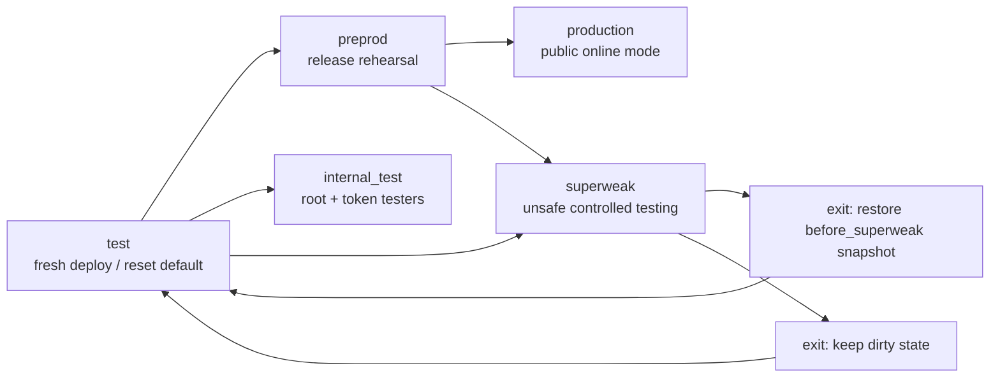

# Server Security Modes

This document records the built-in server/security mode differences as currently
implemented in `services/snapshots.py`. Root may create custom profiles from the
Security Center. Built-in profiles are not overwritten: if root changes the
details of a built-in mode, the UI should ask to save those values as a custom
profile and then switch to that custom profile.

## Mode Map

## Built-In Mode Summary

| Mode | Intended use | Required confirmation | Extra side effects | Main risk profile |
|---|---|---|---|---|
| `production` | Public online deployment. | `GO_LIVE` | Applies production hardening: disables test accounts, marks default accounts for password reset, enables strict cloud-drive upload/download scanning. Requires Integrity Guard preprod gate to pass. | Strictest normal mode. |
| `preprod` | Release candidate / staging before public use. | none | Requires Integrity Guard preprod gate to pass. No test-account disable or default-account reset side effect. | Production-like, but less account hardening. |
| `internal_test` | Closed beta where only root and token-approved testers can log in. | none | Revokes existing non-root sessions. Non-root login requires root-issued internal-test token. | Strict login gate, useful for private testing. |
| `test` | Fresh deploy/reset default and normal local QA. | none | No special account/session hardening. Keeps core logging and chain mechanisms enabled while allowing less strict Integrity Guard behavior. | Safer than superweak, less blocking than preprod. |
| `superweak` | Intentional unsafe mode for controlled security experiments. | `ENABLE_SUPERWEAK` | Creates `before_superweak` snapshot before entering. Exit can restore that snapshot or keep dirty state with explicit confirmation. | Unsafe; major protection mechanisms are disabled. |
| custom profile | Root-defined variant saved from the Security Center. | depends on profile name and route rules | Applies saved settings/thresholds. Built-in-only side effects do not automatically run unless the custom profile name is one of the built-in modes. | Depends on root-defined settings. |

## Security Mechanism Matrix

| Mechanism / setting | `production` | `preprod` | `internal_test` | `test` | `superweak` |
|---|---:|---:|---:|---:|---:|
| Maintenance mode | off | off | off | off | off |
| HTTPS setting (`server_ssl_enabled`) | on | on | on | on | off |
| Open registration (`allow_register`) | off | unchanged | off | unchanged | unchanged |
| Audit hash chain (`audit_chain_enabled`) | on | on | on | on | off |
| Audit log UI/API (`feature_audit_log_enabled`) | on | on | on | on | off |
| Integrity Guard scan (`integrity_guard_enabled`) | on | on | on | on | off |
| Integrity Guard strict mode | on | on | on | off | off |
| Failed-login IP blocking | on | on | on | on | off |
| Failed-login violation records | on | on | on | on | off |
| Rate-limit violation records | on | on | on | on | off |
| Browser-only request filter | on | on | on | off | off |
| Root IP whitelist enforcement | off by default | off by default | off by default | off by default | off |
| Account security page/features | on | unchanged | on | unchanged | unchanged |
| Advanced security page/features | on | unchanged | unchanged | unchanged | unchanged |
| Identity governance | on | unchanged | unchanged | unchanged | unchanged |
| Member governance | on | unchanged | unchanged | unchanged | unchanged |
| Server modes UI/API | on | unchanged | on | unchanged | unchanged |
| Snapshot/restore UI/API | on | unchanged | unchanged | unchanged | unchanged |
| Violation center | on | unchanged | unchanged | unchanged | unchanged |
| Health center | on | unchanged | unchanged | unchanged | unchanged |
| PointsChain / economy APIs | on | on | on | on | off |
| Captcha mode | math | unchanged | unchanged | unchanged | none |

`unchanged` means the built-in profile does not set that key when switching to
the mode. The runtime value remains whatever was already configured.

## Security Threshold Matrix

| Threshold | `production` | `preprod` | `internal_test` | `test` | `superweak` |
|---|---:|---:|---:|---:|---:|
| Pending chat reports | 5 | 10 | 10 | 20 | 50 |
| Pending appeals | 5 | 10 | 10 | 20 | 50 |
| Pending moderation proposals | 5 | 10 | 10 | 20 | 50 |
| Quarantined files | 0 | 0 | 0 | 0 | 10 |
| Unknown encrypted files | 0 | 50 | 25 | 100 | 250 |

## Notes For Optimization

- `production` and `preprod` both require the Integrity Guard preprod gate. The
  difference is that `production` also mutates account state and cloud-drive
  security policy.
- `internal_test` is currently closer to `preprod` than to `test`: strict
  Integrity Guard is on, browser-only mode is on, and registration is off.
- `test` is the default fresh-deploy/reset mode. It still keeps audit chain,
  IP lock, rate-limit violation records, Integrity Guard, and PointsChain on.
- `superweak` should close every major security mechanism. It intentionally does
  not delete ledger or audit data; it stops the runtime gates and APIs so weak
  testing does not continue sealing or exposing those control surfaces.
- Custom profiles can reduce UI clutter later, but they need a clear front-end
  preview because omitted settings inherit the current runtime value.
